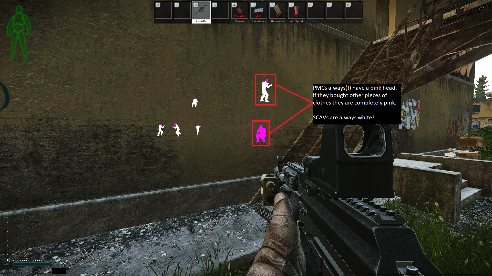

# EFT Pak ESP
 Modded Escape From Tarkov Unity Files. The textures from the .manifest and .bundle files were edited. There are some methods that allow the user to bypass the consistency check.
 Bypass used: Files must have the right file size as the original ones.

 BANWAVE ON 26th JANUARY 2021!
 - ESP: Still UD (as of now) since it was not a public release!
 - ItemESP: Might be detected (public release!)

## Prefabs folder: Modded Unity Character Models (ESP) (Private PAK's!)
- Scavs (White), PMCs (White,Pink)), ScavBoss (Green)
- Replace these files in: YOURDRIVE\Battlestate Games\EFT\EscapeFromTarkov_Data\StreamingAssets\Windows\assets\content\characters\character\prefabs

## Items folder: Item ESP (might be detected as of 26th January 2021! Public PAK's from the thread linked below!)
- Current highlighted items: Car battery, hose, tetriz, ledx, ssd, graphics card, intelligence folder, all keycards
- Replace these files in: YOURDRIVE\Battlestate Games\EFT\EscapeFromTarkov_Data\StreamingAssets\Windows\assets\content\items\THERIGHTSUBFOLDER

## Sounds folder: Not included yet (No Ambient Sound)
- Coming soon..

### Credits
Various user in the EFT Unknowncheats section
- EFT Texture "ESP" Thread (https://www.unknowncheats.me/forum/escape-from-tarkov/435557-eft-texture-esp.html)
- No Ambient Sound Thread (https://www.unknowncheats.me/forum/escape-from-tarkov/415336-ambient-sound.html)
- EFT ESP + Item ESP (https://www.unknowncheats.me/forum/escape-from-tarkov/437605-eft-esp-item-esp.html)